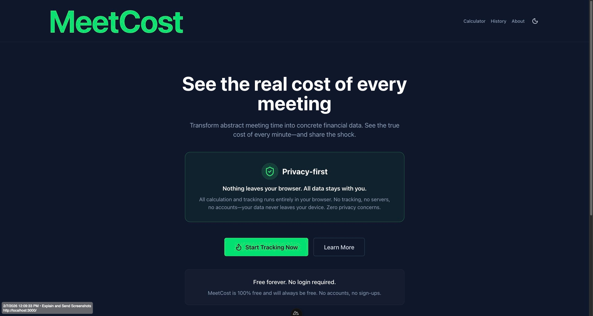
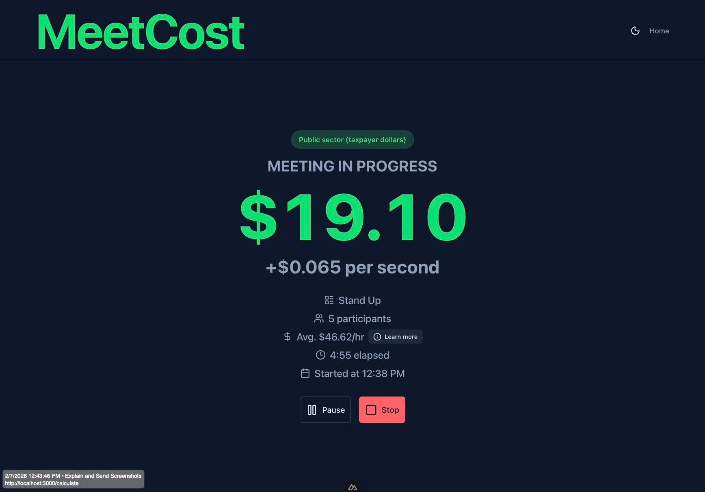
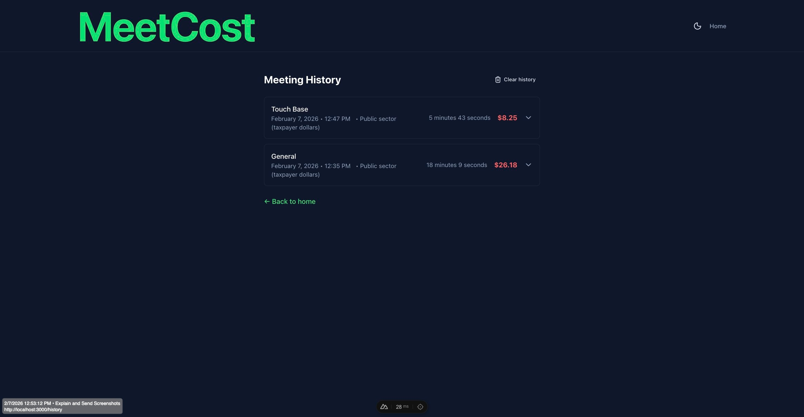
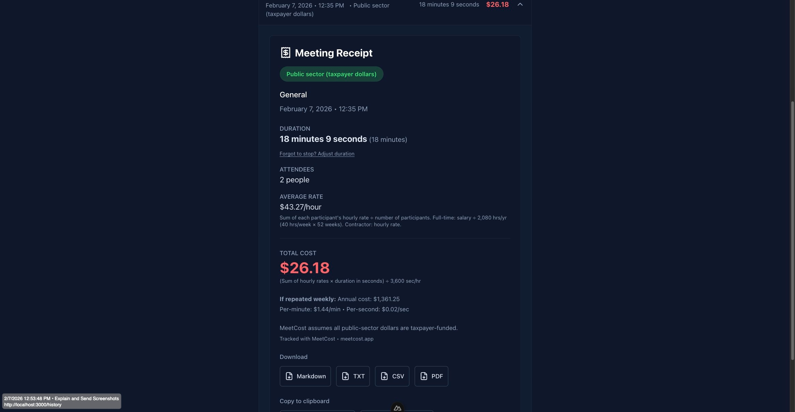

# MeetingBurn

**See the real cost of every meeting.**

🔗 **[meetingburn.app](https://meetingburn.app)**

MeetingBurn is a real-time meeting cost calculator that makes meeting waste visible. Track the true cost of meetings with a live-ticking counter, shareable receipts, and support for both private-sector and taxpayer-funded (public-sector) contexts.


## Screenshots

| | |
|:-------------------------:|:-------------------------:|
|  |  |
|  |  |

## Features

- **Live cost counter** — Watch dollars tick up every second during meetings
- **Color-coded thresholds** — Green ($0–500), yellow ($501–2,000), red ($2,001+)
- **Milestone alerts** — Toast notifications at $500, $1K, $5K, and $10K
- **Remote vs. in-person** — Choose meeting format; in-person meetings add optional "in-person tax" (commute time value + extras like coffee, parking) typically paid by employees
- **Industry presets** — One-tap setup for Tech, Government, Consulting, Agency, Corporate, and 20+ industries
- **Setup flow** — Configure participants (full-time salary, contractor hourly, or unknown/estimate); meeting type; and sector (public/private)
- **Meeting timer** — Shows participant count, meeting type, and average hourly rate with an info popup
- **Pause & resume** — Pause tracking when meetings go off-topic
- **Shareable receipts** — Download as Markdown, TXT, CSV, PDF, or PNG; copy to clipboard
- **Share link** — Generate URL-encoded receipt links (`/share?r=...`) for sharing
- **Native share API** — One-tap share to social apps on supported devices (with copy-link fallback)
- **Duration adjustment** — Forgot to stop? Adjust duration on the receipt; cost updates in real time and auto-saves when focus leaves the adjustment field
- **Meeting history** — Meetings saved in local storage (up to 100); adjust duration and view past receipts
- **Public vs. private sector** — Tag meetings as taxpayer-funded (public) or company dollars (private)
- **Meeting types** — Quick-select from General, Stand Up, Touch Base, Sprint Planning, and more
- **Privacy-first** — All computation runs in your browser; no data is sent to any server

## How it works

1. **Setup** — Pick an industry preset or enter participants manually (full-time, contractor, or unknown/estimate). Choose meeting type and sector.
2. **Track** — Start the meeting; the cost counter updates every second.
3. **Share** — Stop to generate a receipt. Export or copy to share with your team.

### Calculation method

- **Full-time salary:** Hourly rate = annual salary ÷ 2,080 (40 hrs/week × 52 weeks)
- **Contractor / unknown:** Hourly rate = the rate you enter
- **Meeting cost:** (Sum of all hourly rates) × (duration in seconds) ÷ 3,600
- **In-person tax (optional):** Commute time value + extras per person (coffee, parking, etc.). Itemized by company vs. employee on the receipt.

See the [About](/about) page for a detailed explanation and examples.

## Tech stack

- **Framework:** Nuxt 4, Vue 3
- **UI:** Nuxt UI v4, Tailwind CSS v4
- **Language:** TypeScript
- **Other:** @vueuse/core, jsPDF 4.x (PDF export), Vitest (tests)

## Requirements

- Node.js 22.x (see `.nvmrc` for exact version)
- Yarn or npm

## Development

```bash
# Install dependencies
yarn install

# Start dev server (http://localhost:3000)
yarn dev

# Build for production (static)
yarn generate

# Preview production build
yarn preview

# Run tests
yarn test
```

### Testing

MeetingBurn is thoroughly tested with **86 unit tests** across 6 suites. Run with `yarn test`. Tests live in `tests/` at the project root, mirroring the `app/` structure.

| Suite | Tests | Coverage |
|-------|-------|----------|
| **calculations** | 22 | Hourly rates, cost-per-second, meeting cost, in-person cost, edge cases |
| **formatting** | 15 | Currency, duration, dates, times, elapsed time |
| **useShareReceipt** | 22 | Privacy, PII protection, share URL generation, PII exclusion |
| **useCalculator** | 8 | Meeting building, remote/in-person, quick-mode participants |
| **sanitize** | 11 | Input sanitization, XSS prevention |
| **comparisons** | 8 | Cost-to-item comparisons |

#### calculations (22 tests)

Core cost math: salary-to-hourly conversion, cost-per-second, meeting cost, and in-person costs (commute + extras). Covers `calculateEffectiveHourlyRate`, `getCostPerSecond`, `getAverageHourlyRate`, `calculateMeetingCost`, and `calculateInPersonCost`. Verifies full-time (salary ÷ 2080) and contractor rates, ignores inactive participants, handles empty/negative inputs, and checks the default 5-person scenario (~6.5¢/second).

#### formatting (15 tests)

Display helpers: `formatCurrency` (USD, 2 decimals), `formatHourlyRate`, `formatDuration` (seconds/minutes/hours, singular/plural), `formatElapsedTime` (M:SS and H:MM:SS), `formatDate`, `formatTime`, `formatDateISO`, and `formatTime24`.

#### useShareReceipt (22 tests) — Sharing & security

Share-link privacy and PII protection:

- **PII exclusion** — Excludes individual salaries, hourly rates, participant IDs, names, roles, meeting IDs, and email-like identifiers. Payload has only whitelisted keys (`t`, `d`, `n`, `c`, `a`, `s`, `m`, `f`, `ct`, `un`). No individual `effectiveHourlyRate` values; only aggregated counts and averages.
- **Round-trip integrity** — Encode/decode preserves only safe, aggregated data. Invalid, corrupted, empty, or malformed base64 payloads return `null`.
- **URL generation** — Share URLs use base64-safe characters and contain no raw sensitive data. Same meeting yields consistent URLs.
- **Privacy guarantees** — Full encode/decode cycle leaks no PII. Payload has no `participants` array. URL parameter uses only base64-safe characters.

These tests ensure share links never expose salary, compensation, or identifying information.

#### useCalculator (8 tests)

Meeting construction: `buildMeeting` returns correct structure, computes `totalCost` from participants and duration, sanitizes meeting descriptions (XSS prevention), and handles remote vs in-person (with/without in-person tax). `createParticipantsFromQuickMode` builds full-time (from salary) and contractor (from hourly rate) participants.

#### sanitize (11 tests)

Input sanitization for safe display and export: strips HTML tags, angle brackets, `javascript:` and `data:` protocols, control characters, and zero-width characters. Rejects non-string input, trims whitespace, enforces `maxLength`, and passes through safe strings.

#### comparisons (8 tests)

Cost-to-item utilities: `generateComparison` returns "0 items" for zero/negative cost and "N item" strings for positive cost. `generateComparisonList` returns up to N items, no duplicates, correct format, and positive quantities.

#### Safe to use

The app is **privacy-first** and **client-only**: your salary data, participant details, and meeting history never leave your device. The test suite verifies that sharing receipts and export flows do not leak PII.

### Using nvm

```bash
nvm use
yarn install
yarn dev
```

## Project structure

```
app/
├── components/calculator/   # LiveCounter, SetupForm, Receipt, PresetPicker
├── composables/             # useCalculator, useReceipt, useShareReceipt, usePresets, useMeetingBurnConfig, useMeetingHistory
├── layouts/                 # default, calculator
├── pages/                   # index, calculate, about, history, share
├── types/                   # Meeting, Participant, SectorType, Preset, etc.
├── utils/                   # formatting, calculations, comparisons, sanitize
└── app.vue

tests/                       # Vitest unit tests (86 tests across 6 suites)
├── composables/             # useCalculator, useShareReceipt
└── utils/                   # calculations, formatting, sanitize, comparisons

public/                      # Static assets (favicon, screenshots)
meetcost.config.ts           # Single source of truth for app config (filename kept for compatibility)
```

## Deployment

### Netlify

1. Connect your repository to Netlify
2. Build command: `yarn generate`
3. Publish directory: `.output/public`

See `netlify.toml` for configuration. Node version matches `.nvmrc` (22.x).

### Security (Netlify)

The `netlify.toml` applies security headers to all responses:

| Header | Purpose |
|--------|---------|
| `X-Frame-Options: DENY` | Prevents clickjacking |
| `X-Content-Type-Options: nosniff` | Prevents MIME sniffing |
| `Referrer-Policy` | Limits referrer leakage; `no-referrer` for `/share` so the `r=` param is never sent as referrer |
| `Strict-Transport-Security` | Enforces HTTPS (1 year, preload) |
| `Permissions-Policy` | Disables camera, mic, geolocation, etc. |
| `Content-Security-Policy` | Restricts script/style/img sources; `'unsafe-inline'` required for Nuxt/Vue hydration |

`X-XSS-Protection` is intentionally omitted (deprecated; CSP is the primary XSS defense). The share page (`/share`) uses `Referrer-Policy: no-referrer` so share links never leak the receipt payload in referrer headers.

### Other platforms

The app is a static Nuxt build. Deploy the contents of `.output/public` to any static host (Vercel, Cloudflare Pages, etc.). Ensure the Node version matches `.nvmrc` for the build step.

## Configuration

App-wide settings live in `meetcost.config.ts`:

- Site URL, app name, tagline
- Sector labels (public/private)
- Meeting type options
- Receipt footer text

## License

MIT — see [LICENSE](LICENSE) for details.
